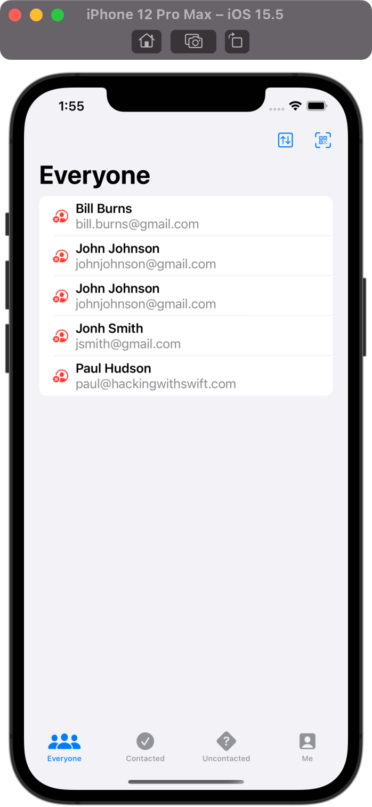
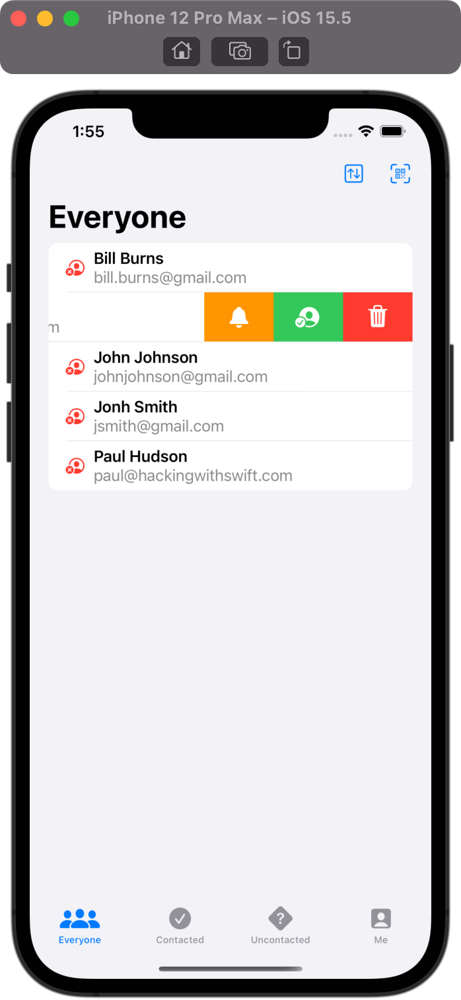
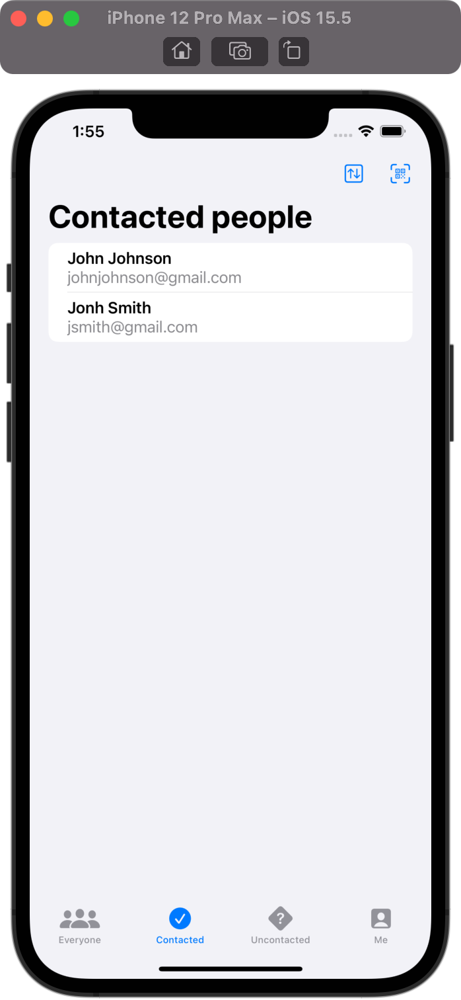
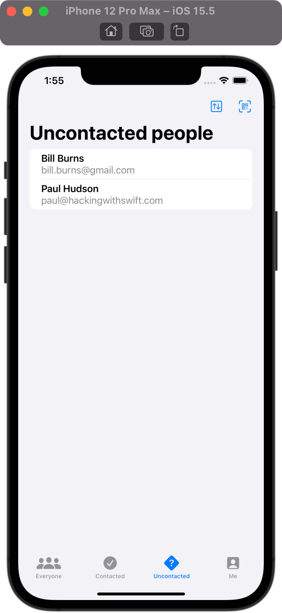
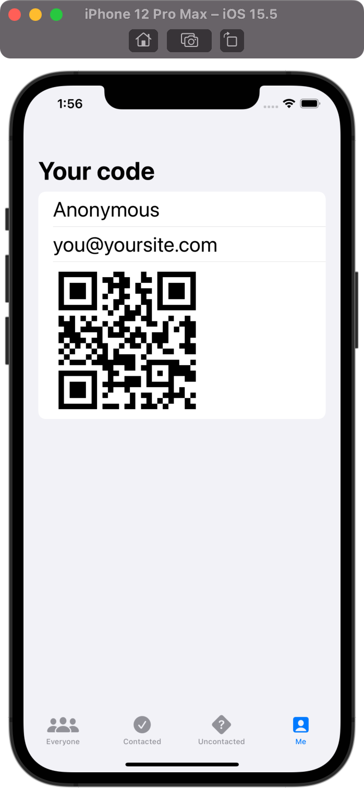

# HotProspects

## Project Description

The project is a part of 100 Days of SwiftUI curriculum by Paul Hudson [Hacking with swift](https://www.hackingwithswift.com/100/swiftui)

The appan tracks those who you meet at conferences. It will show a QR code that stores your attendee information, then others can scan that code to add you to their list of possible leads for later follow up.

## Project Screen

    
